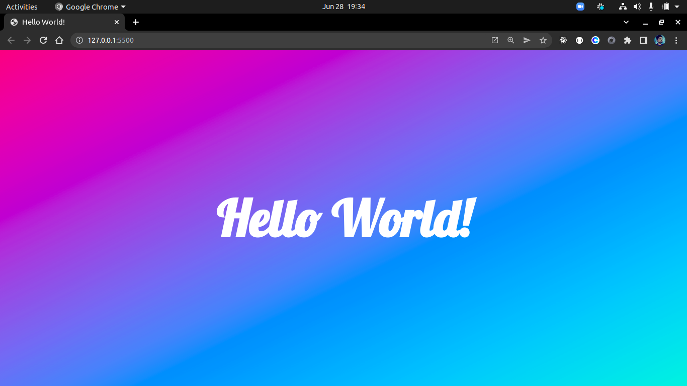

# Hello World

> My first project learning regarding linters and github/workflow

## Built With

- HTML5
- CSS3
- Linters
- Github/workflows

## Live Demo (if available)

[Live Demo Link](https://skyv26.github.io/hello-world/)

## Getting Started

In order to use the files you should have to clone it and then follow the instruction given below.

### Prerequisites
    Install Node.js, Npm
    Copy the linters from "https://github.com/microverseinc/linters-config/tree/master/html-css"

### Setup
    use "git clone https://github.com/skyv26/hello-world.git"

## Authors

👤 **Aakash Verma**

- GitHub: [@githubhandle](https://github.com/skyv26)

## Screenshot

Challenged Design VS My Desktop Solution 

## 📝 License

This project is [MIT](./MIT.md) licensed.
